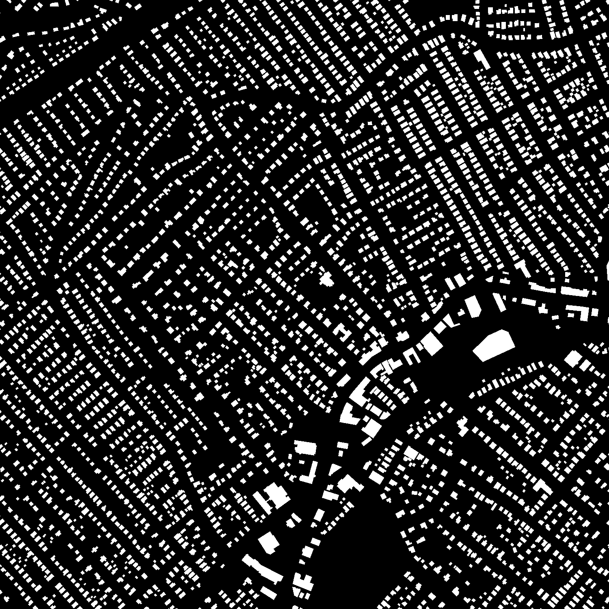

# Specialized project

Created by [Katrine Nguyen](https://github.com/katrineng) and [Martin Wangen-Eriksen](https://github.com/martinwe001) as a part of our specialized project at Norwegian University of Science and Technology [(NTNU)](https://www.ntnu.edu/).

## Models

Most of our code and the U-net model is significantly inspired by this project [Unet-for-Person-Segmentation](https://github.com/nikhilroxtomar/Unet-for-Person-Segmentation). The SegNet model we created on our own based on other implementations of SegNet in Tensorflow.

## Data

The model is trained and tested on Massachusetts Buildings Dataset from [Kaggle](https://www.kaggle.com/balraj98/massachusetts-buildings-dataset). The original images where 1500X1500 pixels each over an area of 1500x1500 meters (1mx1m resolution). The original 137 images were cropped into 64x64 pixels and images without building were filtered out. 

<p>
    
</p>

To make the masks compatible with our model the masks was changed from white (255,255,255) labels to greyscale with value 1. This is done in [image_fix.py](https://github.com/martinwe001/CNNs-for-Building-Segmentation/blob/main/image_processing/image_fix.py) found in the repo.


### Folder structure

Images and masks are saved in local directories and used in [data.py](https://github.com/martinwe001/CNNs-for-Building-Segmentation/blob/main/data.py) and [test.py](https://github.com/martinwe001/CNNs-for-Building-Segmentation/blob/main/test.py). This is of course possible to change, however if you want to use the exact same code you can follow this folder structure.

```

.
├── ...
├── building-segmentation                # Directory for all images
│   ├── Images                           # Directory for raw images
│   │   ├── cropped_images_train_64      # Directory for cropped images where number specifies resolution, containg .jpg
│   │   ├── cropped_images_train_128     # Directory for cropped images where number specifies resolution, containg .jpg 
│   │   └── ...                          # More directories with other resolutions
│   ├── Masks                            # Directory for all maskes
│   │   ├── cropped_masks_train_64       # Directory for cropped masks where number specifies resolution, containg .jpg
│   │   ├── cropped_masks_train_128      # Directory for cropped masks where number specifies resolution, containg .jpg 
│   │   └── ...                          # More directories with other resolutions
│   └── Test                             # Miscellaneous information
│       ├── test_64                      # Directory for images where number specifies resolution, containing .jpg
│       └── ...                          # More directories with other resolutions
└── ...
```

## Running the project

### Requirements

### Training

### Testing
